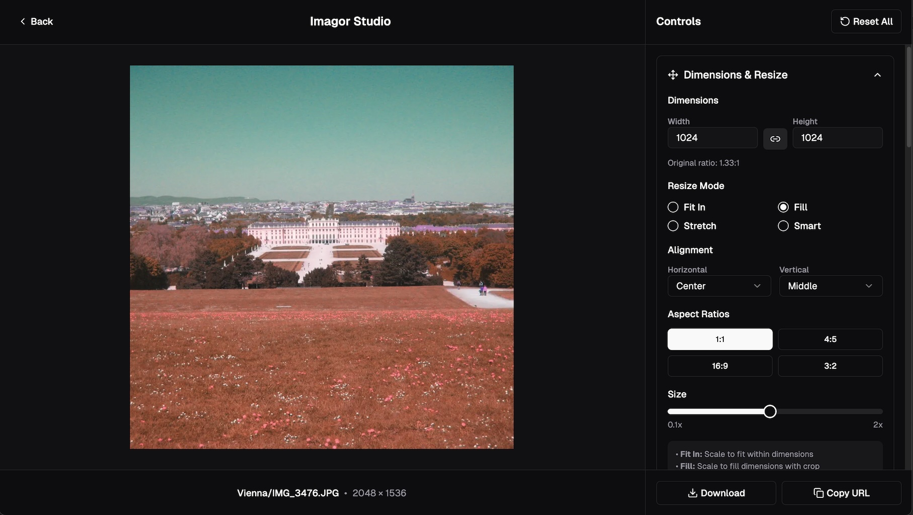
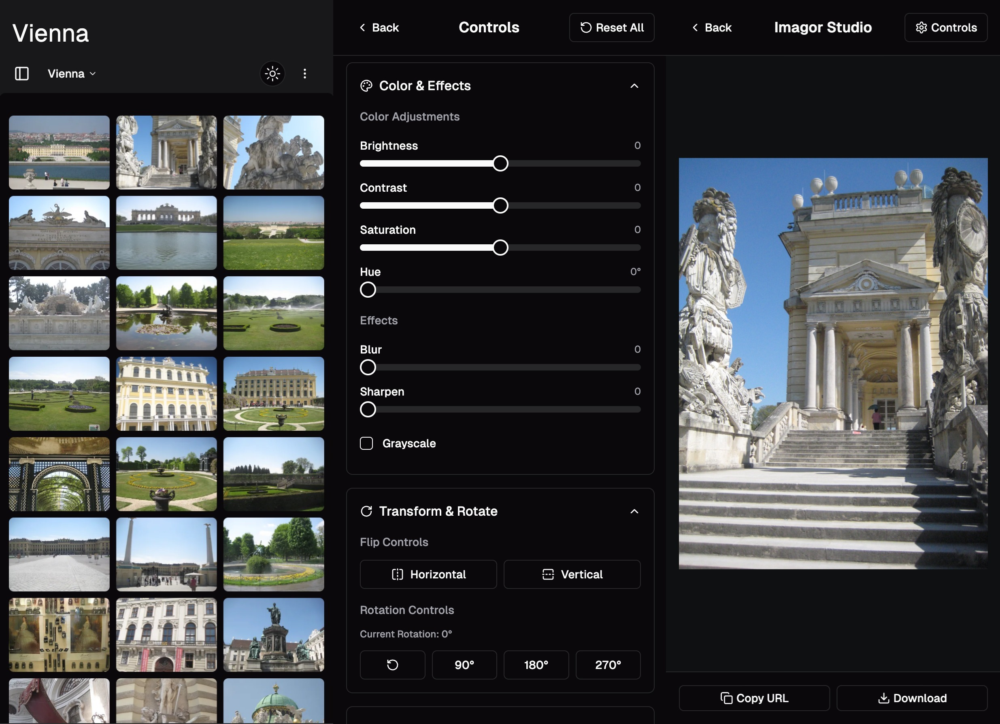

# Imagor Studio

Self-hosted image gallery and live editing web application, for creators and professionals

<div align="center">
  
  
  
</div>

## Quick Start

```bash
git clone https://github.com/cshum/imagor-studio.git
cd imagor-studio
docker-compose up -d
open http://localhost:8000
```

## Architecture

### Backend (Go)
- **GraphQL API** with gqlgen
- **Image Processing** via [imagor](https://github.com/cshum/imagor) and libvips
- **Authentication** with JWT
- **Storage** abstraction (filesystem/S3)
- **Configuration Management** - Registry-based system with environment/CLI override support
- **Encryption** - AES-256-GCM encryption for sensitive configuration data

### Frontend (React)
- **Vite** + TypeScript + Tailwind CSS
- **TanStack Router** for type-safe routing with loaders
- **shadcn/ui** component library
- **Custom Store** implementation with React integration
- **GraphQL** client with code generation

## Documentation

- **[BUILD.md](BUILD.md)** - Build instructions
- **[DOCKER.md](DOCKER.md)** - Docker deployment

## Ecosystem

Part of the imagor image processing ecosystem:
- **[imagor](https://github.com/cshum/imagor)** - Fast, secure image processing server and Go library, using libvips
- **[vipsgen](https://github.com/cshum/vipsgen)** - Type-safe, comprehensive Go binding generator for libvips
