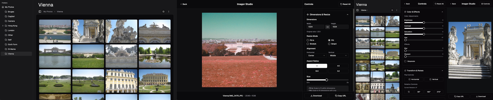

# Imagor Studio

[](https://github.com/cshum/imagor-studio/actions/workflows/test.yml)
[](https://hub.docker.com/r/shumc/imagor-studio/)

Self-hosted image gallery and live editing web application for creators

* High-performance image gallery with virtual scrolling and live editing capabilities powered by imagor.
* Zero-configuration setup with universal storage support and non-destructive workflow.
* Advanced image editing with real-time preview, color adjustments, effects, cropping, and instant URL generation for transformed images.
* Touch-optimized interface that works seamlessly on mobile while maintaining desktop power and full functionality.



## Quick Start

Run with SQLite database and your image directory mounted. You can replace `~/Pictures` with the path to your preferred directory (e.g., `~/Desktop`, `~/MyPhotos`, `~/Downloads`).

```bash
docker run -p 8000:8000 --rm \
  --name imagor-studio \
  -v $(pwd)/imagor-studio-data:/app/data \
  -v ~/Pictures:/app/gallery:ro \
  -e DATABASE_URL="sqlite:///app/data/imagor-studio.db" \
  shumc/imagor-studio
```

Open in browser 

```
http://localhost:8000
```

**What this does:**
- Mounts your Photos directory as read-only for safe access
- Creates persistent storage for the app database (SQLite)
- Redirects to admin setup process on first launch

## Documentation

- **[Configuration Guide](CONFIGURATION.md)** - Server configuration options, database setup, environment variables, CLI arguments, and system registry settings
- **[Migration Guide](MIGRATION.md)** - Database migration management for PostgreSQL/MySQL deployments

## Architecture

### Server (Go)
- **GraphQL API** with gqlgen
- **Image Processing** via [imagor](https://github.com/cshum/imagor) and [libvips](https://github.com/libvips/libvips)
- **Authentication** with JWT
- **Storage** abstraction (filesystem/S3)
- **Configuration Management** - Registry-based system with environment/CLI override support
- **Encryption** - AES-256-GCM encryption for sensitive configuration data

### Web (React)
- **Vite** + TypeScript + Tailwind CSS
- **TanStack Router** for type-safe routing with loaders
- **shadcn/ui** component library
- **Custom Store** implementation with React integration
- **GraphQL** client with code generation

## Ecosystem

Part of the imagor ecosystem:

- **[imagor](https://github.com/cshum/imagor)** - Fast, secure image processing server and Go library, using libvips
- **[vipsgen](https://github.com/cshum/vipsgen)** - Type-safe, comprehensive Go binding generator for libvips
- **[imagorvideo](https://github.com/cshum/imagorvideo)** - imagor video thumbnail server in Go and ffmpeg C bindings

---

Built with ❤️ for creators.
