# Architecture

Understanding the technical architecture of Imagor Studio.

For the upstream image-processing reference behind the runtime pipeline, see the [imagor docs](https://docs.imagor.net/). For measured performance comparisons, see [imagor benchmarks](https://docs.imagor.net/benchmarks).

## System Overview

Imagor Studio is built as a modern web application with a clear separation between backend and frontend:

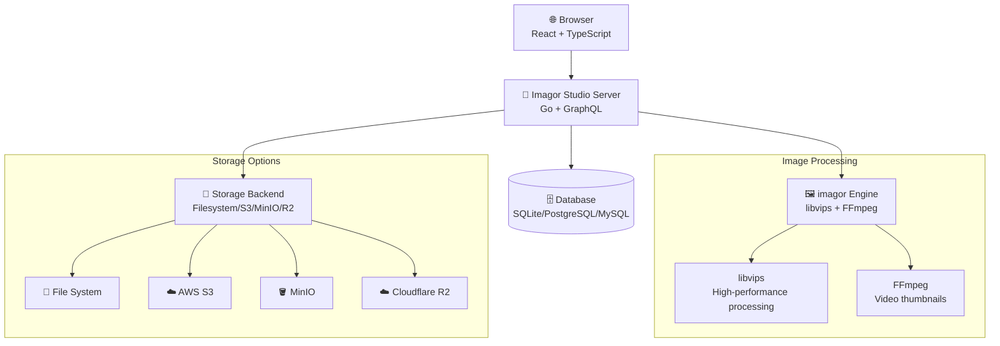
```mermaid
graph TB
    Browser[🌐 Browser<br/>React + TypeScript] --> Server[🚀 Imagor Studio Server<br/>Go + GraphQL]
    Server --> DB[(🗄️ Database<br/>SQLite/PostgreSQL/MySQL)]
    Server --> Storage[💾 Storage Backend<br/>Filesystem/S3/MinIO/R2]
    Server --> Imagor[🖼️ imagor Engine<br/>libvips + FFmpeg]

    subgraph "Image Processing"
        Imagor --> libvips[libvips<br/>High-performance processing]
        Imagor --> FFmpeg[FFmpeg<br/>Video thumbnails]
    end

    subgraph "Storage Options"
        Storage --> FS[📁 File System]
        Storage --> S3[☁️ AWS S3]
        Storage --> MinIO[🪣 MinIO]
        Storage --> R2[☁️ Cloudflare R2]
    end
```

## Multi-Stage Docker Build

Imagor Studio uses a sophisticated multi-stage Docker build process that creates an extremely lean final image by embedding the compiled frontend into the Go binary.

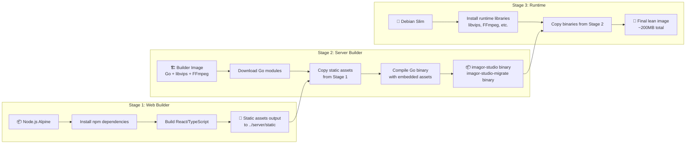
```mermaid
graph LR
    subgraph "Stage 1: Web Builder"
        A[📦 Node.js Alpine] --> B[Install npm dependencies]
        B --> C[Build React/TypeScript]
        C --> D[📁 Static assets output<br/>to ../server/static]
    end

    subgraph "Stage 2: Server Builder"
        E[🏗️ Builder Image<br/>Go + libvips + FFmpeg] --> F[Download Go modules]
        F --> G[Copy static assets<br/>from Stage 1]
        G --> H[Compile Go binary<br/>with embedded assets]
        H --> I[📦 imagor-studio binary<br/>imagor-studio-migrate binary]
    end

    subgraph "Stage 3: Runtime"
        J[🐧 Debian Slim] --> K[Install runtime libraries<br/>libvips, FFmpeg, etc.]
        K --> L[Copy binaries from Stage 2]
        L --> M[🚀 Final lean image<br/>~200MB total]
    end

    D --> G
    I --> L
```

### Build Process Details

#### Stage 1: Web Builder (`node:22-alpine`)

- **Purpose**: Compile TypeScript/React frontend
- **Input**: Source code from `web/` directory
- **Process**:
  1. Install npm dependencies
  2. Run Vite build process
  3. Output static assets to `../server/static`
- **Output**: Compiled HTML, CSS, JavaScript files

#### Stage 2: Server Builder (`imagor-base ...-magick-ffmpeg-dev`)

- **Purpose**: Compile Go server with embedded frontend
- **Input**: Go source code + static assets from Stage 1
- **Process**:
  1. Download Go module dependencies
  2. Copy static assets from web builder
    3. Use the shared `imagor-base` magick+ffmpeg dev image for CGO headers and libraries
    4. Use Go's `embed.FS` to embed static files into binary
    5. Compile optimized Go binaries
- **Output**: Self-contained binaries with embedded web assets

#### Stage 3: Runtime (`imagor-base ...-magick-ffmpeg`)

- **Purpose**: Minimal runtime environment
- **Input**: Compiled binaries from Stage 2
- **Process**:
    1. Reuse the shared `imagor-base` runtime image with libvips, ImageMagick, and FFmpeg libs preinstalled
    2. Copy application binaries
    3. Install only small app-specific runtime packages
    4. Configure unprivileged user
- **Output**: Lean production image (~200MB)

### Benefits of Multi-Stage Build

- **🪶 Lean Image Size**: Final image contains only runtime essentials
- **📦 Single Binary**: Web assets embedded in Go binary via `embed.FS`
- **🚀 Fast Startup**: No separate web server needed
- **🔒 Security**: Minimal attack surface, unprivileged user
- **📱 Portable**: Self-contained deployment artifact

## Server Architecture (Go)

### Core Components

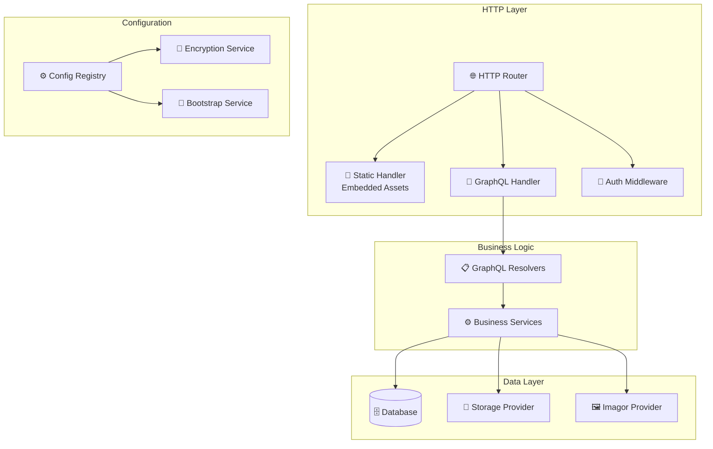
```mermaid
graph TB
    subgraph "HTTP Layer"
        Router[🌐 HTTP Router] --> Static[📁 Static Handler<br/>Embedded Assets]
        Router --> GraphQL[🔗 GraphQL Handler]
        Router --> Auth[🔐 Auth Middleware]
    end

    subgraph "Business Logic"
        GraphQL --> Resolvers[📋 GraphQL Resolvers]
        Resolvers --> Services[⚙️ Business Services]
    end

    subgraph "Data Layer"
        Services --> DB[(🗄️ Database)]
        Services --> Storage[💾 Storage Provider]
        Services --> Imagor[🖼️ Imagor Provider]
    end

    subgraph "Configuration"
        Config[⚙️ Config Registry] --> Encryption[🔐 Encryption Service]
        Config --> Bootstrap[🚀 Bootstrap Service]
    end
```

#### GraphQL API

- **Framework**: [gqlgen](https://github.com/99designs/gqlgen)
- **Purpose**: Type-safe GraphQL server
- **Features**:
  - Auto-generated resolvers
  - Schema-first development
  - Strong typing

#### Image Processing

- **Engine**: [imagor](https://github.com/cshum/imagor)
- **Library**: [libvips](https://github.com/libvips/libvips)
- **Features**:
  - High-performance image transformations
  - Memory-efficient streaming
  - Multi-format support
  - Video thumbnail generation (FFmpeg)

#### Authentication

- **Method**: JWT (JSON Web Tokens)
- **Features**:
  - Stateless authentication
  - Configurable expiration
  - Secure token signing

#### Storage Abstraction

- **Interface**: Unified storage API
- **Implementations**:
  - File storage (local filesystem)
  - S3 storage (AWS S3, MinIO, etc.)
- **Features**:
  - Pluggable backends
  - Read-only access
  - Path-based organization

#### Configuration Management

- **System**: Multi-layered registry
- **Priority Order**:

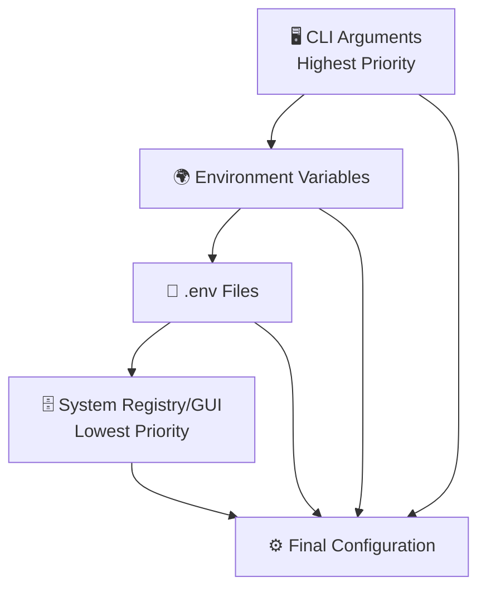
```mermaid
graph TD
    CLI[🖥️ CLI Arguments<br/>Highest Priority] --> ENV[🌍 Environment Variables]
    ENV --> File[📄 .env Files]
    File --> Registry[🗄️ System Registry/GUI<br/>Lowest Priority]
    Registry --> Final[⚙️ Final Configuration]

    CLI --> Final
    ENV --> Final
    File --> Final
```

#### Encryption System

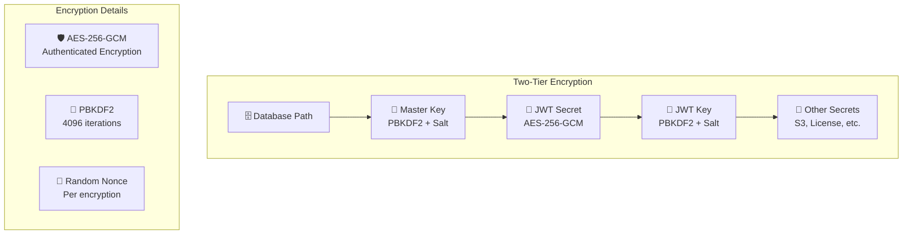
```mermaid
graph TB
    subgraph "Two-Tier Encryption"
        DB_PATH[🗄️ Database Path] --> MASTER[🔑 Master Key<br/>PBKDF2 + Salt]
        MASTER --> JWT_SECRET[🔐 JWT Secret<br/>AES-256-GCM]

        JWT_SECRET --> JWT_KEY[🔑 JWT Key<br/>PBKDF2 + Salt]
        JWT_KEY --> SECRETS[🔐 Other Secrets<br/>S3, License, etc.]
    end

    subgraph "Encryption Details"
        AES[🛡️ AES-256-GCM<br/>Authenticated Encryption]
        PBKDF2[🔄 PBKDF2<br/>4096 iterations]
        NONCE[🎲 Random Nonce<br/>Per encryption]
    end
```

### Package Structure

```
server/
├── cmd/                    # Entry points
│   ├── imagor-studio/     # Main application
│   └── imagor-studio-migrate/  # Migration tool
├── internal/              # Internal packages
│   ├── auth/             # Authentication
│   ├── config/           # Configuration
│   ├── database/         # Database connection
│   ├── encryption/       # Encryption utilities
│   ├── httphandler/      # HTTP handlers
│   ├── imagorprovider/   # Imagor integration
│   ├── middleware/       # HTTP middleware
│   ├── migrations/       # Database migrations
│   ├── model/            # Data models
│   ├── resolver/         # GraphQL resolvers
│   ├── storage/          # Storage backends
│   └── storageprovider/  # Storage factory
└── static/               # Embedded web assets (from build)
```

## Web Architecture (React)

### Technology Stack

- **Build Tool**: Vite
- **Language**: TypeScript
- **Styling**: Tailwind CSS
- **Router**: TanStack Router (type-safe)
- **UI Components**: shadcn/ui
- **State Management**: Custom store with React integration
- **GraphQL Client**: graphql-request with code generation

### Key Features

#### Virtual Scrolling

- Efficient rendering of large image galleries
- Smooth scrolling performance
- Dynamic loading and unloading

#### Live Image Editing

- Real-time preview
- Non-destructive transformations
- URL-based image manipulation
- Instant URL generation

#### Touch Optimization

- Mobile-first design
- Touch gestures support
- Responsive layouts
- Progressive enhancement

### Component Architecture

```
web/src/
├── api/                  # API clients
├── components/           # React components
│   ├── ui/              # Base UI components
│   ├── image-gallery/   # Gallery components
│   ├── image-editor/    # Editor components
│   └── folder-tree/     # File browser
├── pages/               # Route pages
├── stores/              # State management
├── hooks/               # Custom React hooks
├── loaders/             # Data loaders
└── graphql/             # GraphQL queries
```

## Data Flow

### Image Gallery Flow

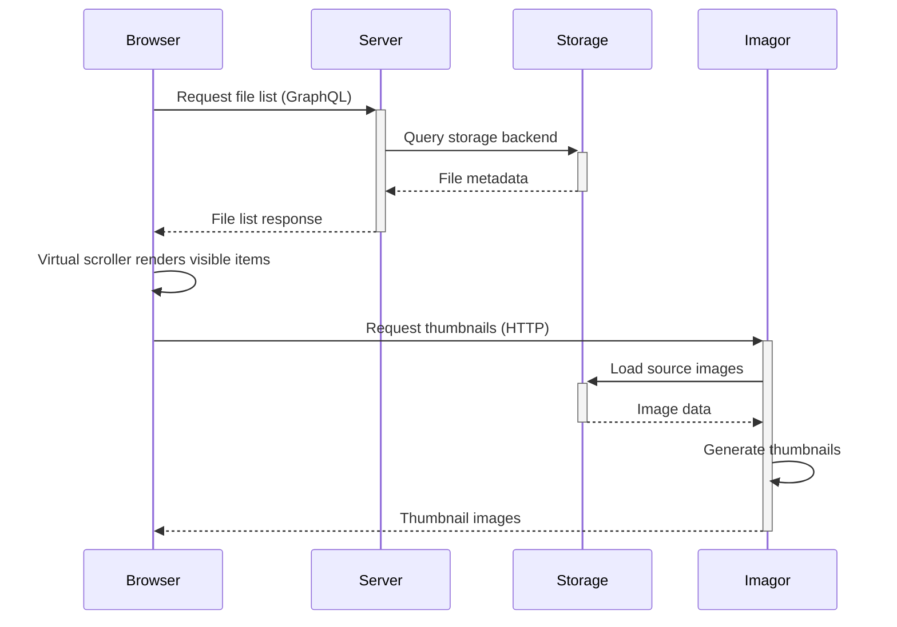
```mermaid
sequenceDiagram
    participant Browser
    participant Server
    participant Storage
    participant Imagor

    Browser->>+Server: Request file list (GraphQL)
    Server->>+Storage: Query storage backend
    Storage-->>-Server: File metadata
    Server-->>-Browser: File list response

    Browser->>Browser: Virtual scroller renders visible items
    Browser->>+Imagor: Request thumbnails (HTTP)
    Imagor->>+Storage: Load source images
    Storage-->>-Imagor: Image data
    Imagor->>Imagor: Generate thumbnails
    Imagor-->>-Browser: Thumbnail images
```

### Image Editing Flow

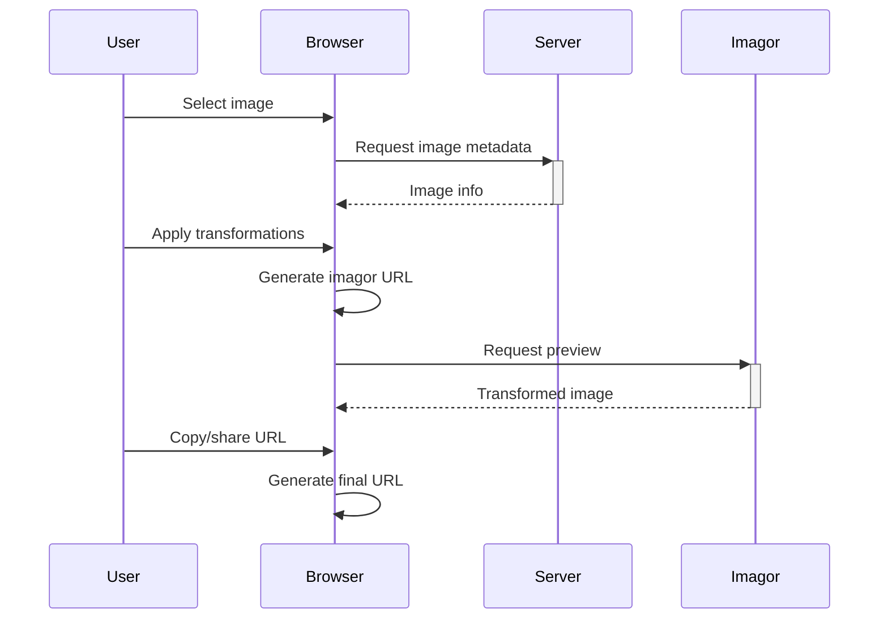
```mermaid
sequenceDiagram
    participant User
    participant Browser
    participant Server
    participant Imagor

    User->>Browser: Select image
    Browser->>+Server: Request image metadata
    Server-->>-Browser: Image info

    User->>Browser: Apply transformations
    Browser->>Browser: Generate imagor URL
    Browser->>+Imagor: Request preview
    Imagor-->>-Browser: Transformed image

    User->>Browser: Copy/share URL
    Browser->>Browser: Generate final URL
```

## Security Architecture

### Authentication Flow

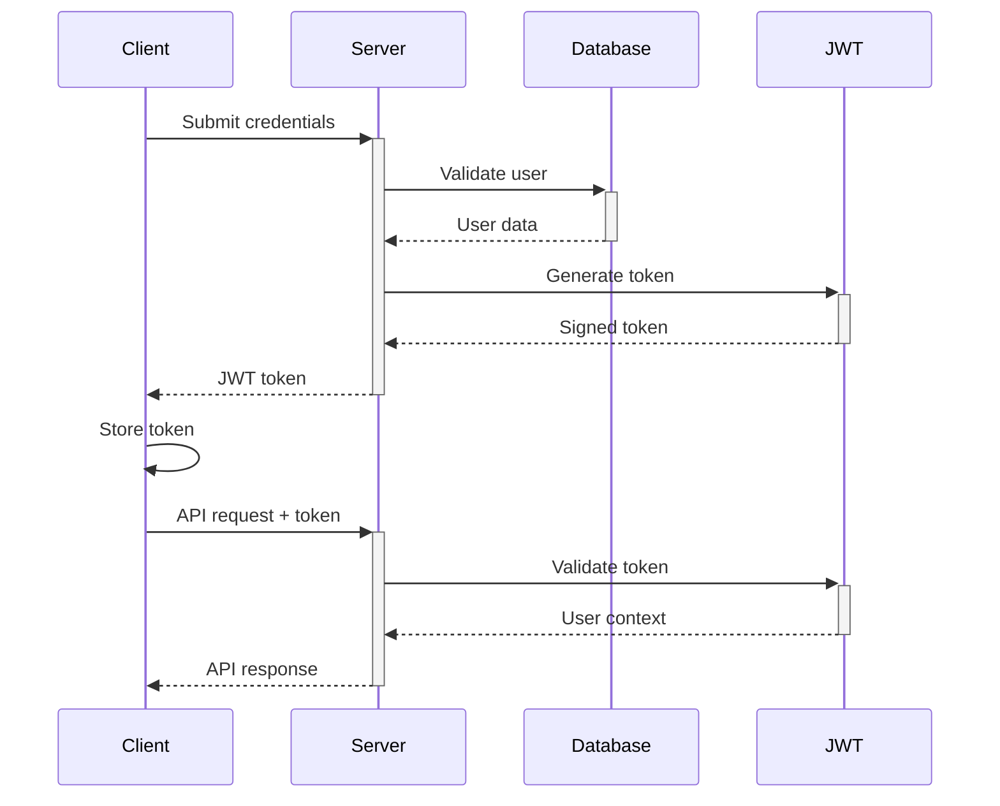
```mermaid
sequenceDiagram
    participant Client
    participant Server
    participant Database
    participant JWT

    Client->>+Server: Submit credentials
    Server->>+Database: Validate user
    Database-->>-Server: User data
    Server->>+JWT: Generate token
    JWT-->>-Server: Signed token
    Server-->>-Client: JWT token

    Client->>Client: Store token
    Client->>+Server: API request + token
    Server->>+JWT: Validate token
    JWT-->>-Server: User context
    Server-->>-Client: API response
```

### Encryption Flow

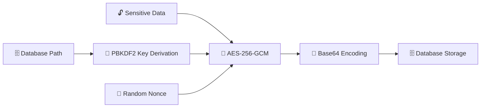
```mermaid
graph LR
    A[🔓 Sensitive Data] --> B[🔐 AES-256-GCM]
    B --> C[📝 Base64 Encoding]
    C --> D[🗄️ Database Storage]

    E[🗄️ Database Path] --> F[🔑 PBKDF2 Key Derivation]
    F --> B

    G[🎲 Random Nonce] --> B
```

## Deployment Architecture

### Single Instance

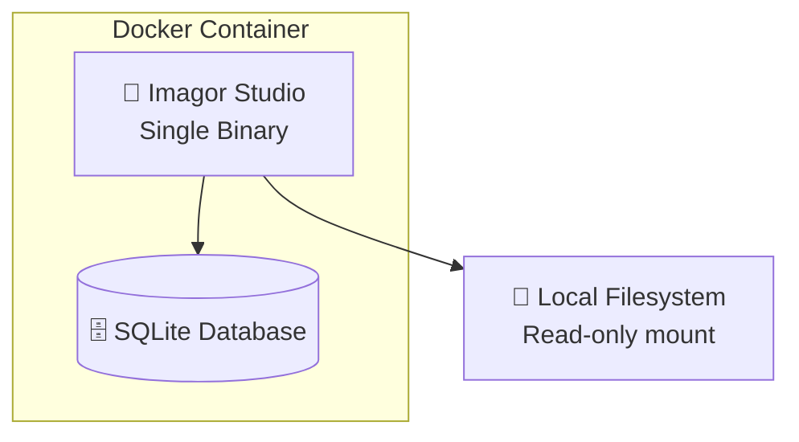
```mermaid
graph TB
    subgraph "Docker Container"
        App[🚀 Imagor Studio<br/>Single Binary]
        DB[(🗄️ SQLite Database)]
        App --> DB
    end

    FS[📁 Local Filesystem<br/>Read-only mount]
    App --> FS
```

### Multi-Instance (Production)

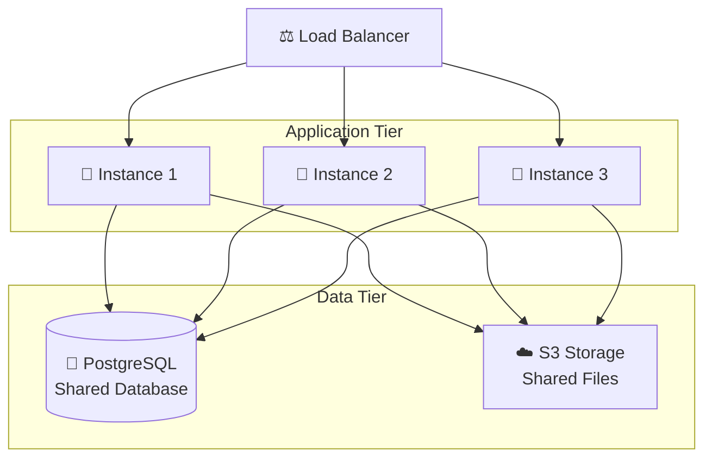
```mermaid
graph TB
    LB[⚖️ Load Balancer]

    subgraph "Application Tier"
        I1[🚀 Instance 1]
        I2[🚀 Instance 2]
        I3[🚀 Instance 3]
    end

    subgraph "Data Tier"
        PG[(🐘 PostgreSQL<br/>Shared Database)]
        S3[☁️ S3 Storage<br/>Shared Files]
    end

    LB --> I1
    LB --> I2
    LB --> I3

    I1 --> PG
    I2 --> PG
    I3 --> PG

    I1 --> S3
    I2 --> S3
    I3 --> S3
```

## Performance Considerations

### Image Processing

- **libvips**: Streaming processing for memory efficiency
- **Multi-threading**: Parallel processing on multi-core systems
- **Format optimization**: Automatic format selection (WebP, AVIF)

### Database

- **Connection pooling**: Efficient database connections
- **Indexed queries**: Fast data retrieval
- **Migration system**: Safe schema updates

### Frontend

- **Code splitting**: Lazy loading of routes
- **Virtual scrolling**: Efficient rendering
- **Image lazy loading**: Load images on demand
- **Caching**: Browser and CDN caching

## Scalability

### Horizontal Scaling

- Stateless application design
- Shared database backend
- Shared storage backend
- Load balancer compatible

### Vertical Scaling

- Multi-core CPU utilization
- Memory-efficient processing
- Configurable resource limits

## Build Optimization

The multi-stage Docker build process ensures optimal deployment:

1. **Development Dependencies Excluded**: Node.js, TypeScript compiler, and build tools are not in the final image
2. **Static Asset Embedding**: Frontend assets are compiled into the Go binary using `embed.FS`
3. **Minimal Runtime**: Only essential libraries for libvips and FFmpeg are included
4. **Layer Optimization**: Docker layers are optimized for caching and minimal size
5. **Security**: Runs as unprivileged user with minimal attack surface

This results in a production image that's approximately **200MB** compared to what would be **1GB+** with traditional approaches.

## Next Steps

- [Configuration Overview](./configuration/overview) - Configure the system
- [Deployment Guide](./deployment/migration) - Deploy in production
- [Ecosystem](./ecosystem) - Related projects
