# Architecture

Understanding the technical architecture of Imagor Studio.

## System Overview

Imagor Studio is built as a modern web application with a clear separation between backend and frontend:

```mermaid
graph TB
    Browser[🌐 Browser<br/>React + TypeScript] --> Server[🚀 Imagor Studio Server<br/>Go + GraphQL]
    Server --> DB[(🗄️ Database<br/>SQLite/PostgreSQL/MySQL)]
    Server --> Storage[💾 Storage Backend<br/>Filesystem/S3/MinIO/R2]
    Server --> Imagor[🖼️ imagor Engine<br/>libvips + FFmpeg]
    
    subgraph "Image Processing"
        Imagor --> libvips[libvips<br/>High-performance processing]
        Imagor --> FFmpeg[FFmpeg<br/>Video thumbnails]
    end
    
    subgraph "Storage Options"
        Storage --> FS[📁 File System]
        Storage --> S3[☁️ AWS S3]
        Storage --> MinIO[🪣 MinIO]
        Storage --> R2[☁️ Cloudflare R2]
    end
```



## Multi-Stage Docker Build

Imagor Studio uses a sophisticated multi-stage Docker build process that creates an extremely lean final image by embedding the compiled frontend into the Go binary.


### Build Process Details

#### Stage 1: Web Builder (`node:22-alpine`)
- **Purpose**: Compile TypeScript/React frontend
- **Input**: Source code from `web/` directory
- **Process**: 
  1. Install npm dependencies
  2. Run Vite build process
  3. Output static assets to `../server/static`
- **Output**: Compiled HTML, CSS, JavaScript files

#### Stage 2: Server Builder (`imagor-studio-builder`)
- **Purpose**: Compile Go server with embedded frontend
- **Input**: Go source code + static assets from Stage 1
- **Process**:
  1. Download Go module dependencies
  2. Copy static assets from web builder
  3. Use Go's `embed.FS` to embed static files into binary
  4. Compile optimized Go binaries
- **Output**: Self-contained binaries with embedded web assets

#### Stage 3: Runtime (`debian:trixie-slim`)
- **Purpose**: Minimal runtime environment
- **Input**: Compiled binaries from Stage 2
- **Process**:
  1. Install only essential runtime libraries
  2. Copy binaries and required shared libraries
  3. Configure unprivileged user
- **Output**: Lean production image (~200MB)

### Benefits of Multi-Stage Build

- **🪶 Lean Image Size**: Final image contains only runtime essentials
- **📦 Single Binary**: Web assets embedded in Go binary via `embed.FS`
- **🚀 Fast Startup**: No separate web server needed
- **🔒 Security**: Minimal attack surface, unprivileged user
- **📱 Portable**: Self-contained deployment artifact

## Server Architecture (Go)

### Core Components

```mermaid
graph TB
    subgraph "HTTP Layer"
        Router[🌐 HTTP Router] --> Static[📁 Static Handler<br/>Embedded Assets]
        Router --> GraphQL[🔗 GraphQL Handler]
        Router --> Auth[🔐 Auth Middleware]
    end
    
    subgraph "Business Logic"
        GraphQL --> Resolvers[📋 GraphQL Resolvers]
        Resolvers --> Services[⚙️ Business Services]
    end
    
    subgraph "Data Layer"
        Services --> DB[(🗄️ Database)]
        Services --> Storage[💾 Storage Provider]
        Services --> Imagor[🖼️ Imagor Provider]
    end
    
    subgraph "Configuration"
        Config[⚙️ Config Registry] --> Encryption[🔐 Encryption Service]
        Config --> Bootstrap[🚀 Bootstrap Service]
    end
```



#### GraphQL API
- **Framework**: [gqlgen](https://github.com/99designs/gqlgen)
- **Purpose**: Type-safe GraphQL server
- **Features**: 
  - Auto-generated resolvers
  - Schema-first development
  - Strong typing

#### Image Processing
- **Engine**: [imagor](https://github.com/cshum/imagor)
- **Library**: [libvips](https://github.com/libvips/libvips)
- **Features**:
  - High-performance image transformations
  - Memory-efficient streaming
  - Multi-format support
  - Video thumbnail generation (FFmpeg)

#### Authentication
- **Method**: JWT (JSON Web Tokens)
- **Features**:
  - Stateless authentication
  - Configurable expiration
  - Secure token signing

#### Storage Abstraction
- **Interface**: Unified storage API
- **Implementations**:
  - File storage (local filesystem)
  - S3 storage (AWS S3, MinIO, etc.)
- **Features**:
  - Pluggable backends
  - Read-only access
  - Path-based organization

#### Configuration Management
- **System**: Multi-layered registry
- **Priority Order**:

```mermaid
graph TD
    CLI[🖥️ CLI Arguments<br/>Highest Priority] --> ENV[🌍 Environment Variables]
    ENV --> File[📄 .env Files]
    File --> Registry[🗄️ System Registry/GUI<br/>Lowest Priority]
    Registry --> Final[⚙️ Final Configuration]
    
    CLI --> Final
    ENV --> Final
    File --> Final
```



#### Encryption System

```mermaid
graph TB
    subgraph "Two-Tier Encryption"
        DB_PATH[🗄️ Database Path] --> MASTER[🔑 Master Key<br/>PBKDF2 + Salt]
        MASTER --> JWT_SECRET[🔐 JWT Secret<br/>AES-256-GCM]
        
        JWT_SECRET --> JWT_KEY[🔑 JWT Key<br/>PBKDF2 + Salt]
        JWT_KEY --> SECRETS[🔐 Other Secrets<br/>S3, License, etc.]
    end
    
    subgraph "Encryption Details"
        AES[🛡️ AES-256-GCM<br/>Authenticated Encryption]
        PBKDF2[🔄 PBKDF2<br/>4096 iterations]
        NONCE[🎲 Random Nonce<br/>Per encryption]
    end
```



### Package Structure

```
server/
├── cmd/                    # Entry points
│   ├── imagor-studio/     # Main application
│   └── imagor-studio-migrate/  # Migration tool
├── internal/              # Internal packages
│   ├── auth/             # Authentication
│   ├── config/           # Configuration
│   ├── database/         # Database connection
│   ├── encryption/       # Encryption utilities
│   ├── httphandler/      # HTTP handlers
│   ├── imagorprovider/   # Imagor integration
│   ├── middleware/       # HTTP middleware
│   ├── migrations/       # Database migrations
│   ├── model/            # Data models
│   ├── resolver/         # GraphQL resolvers
│   ├── storage/          # Storage backends
│   └── storageprovider/  # Storage factory
└── static/               # Embedded web assets (from build)
```

## Web Architecture (React)

### Technology Stack

- **Build Tool**: Vite
- **Language**: TypeScript
- **Styling**: Tailwind CSS
- **Router**: TanStack Router (type-safe)
- **UI Components**: shadcn/ui
- **State Management**: Custom store with React integration
- **GraphQL Client**: graphql-request with code generation

### Key Features

#### Virtual Scrolling
- Efficient rendering of large image galleries
- Smooth scrolling performance
- Dynamic loading and unloading

#### Live Image Editing
- Real-time preview
- Non-destructive transformations
- URL-based image manipulation
- Instant URL generation

#### Touch Optimization
- Mobile-first design
- Touch gestures support
- Responsive layouts
- Progressive enhancement

### Component Architecture

```
web/src/
├── api/                  # API clients
├── components/           # React components
│   ├── ui/              # Base UI components
│   ├── image-gallery/   # Gallery components
│   ├── image-editor/    # Editor components
│   └── folder-tree/     # File browser
├── pages/               # Route pages
├── stores/              # State management
├── hooks/               # Custom React hooks
├── loaders/             # Data loaders
└── graphql/             # GraphQL queries
```

## Data Flow

### Image Gallery Flow


### Image Editing Flow


## Security Architecture

### Authentication Flow


### Encryption Flow

```mermaid
graph LR
    A[🔓 Sensitive Data] --> B[🔐 AES-256-GCM]
    B --> C[📝 Base64 Encoding]
    C --> D[🗄️ Database Storage]
    
    E[🗄️ Database Path] --> F[🔑 PBKDF2 Key Derivation]
    F --> B
    
    G[🎲 Random Nonce] --> B
```



## Deployment Architecture

### Single Instance

```mermaid
graph TB
    subgraph "Docker Container"
        App[🚀 Imagor Studio<br/>Single Binary]
        DB[(🗄️ SQLite Database)]
        App --> DB
    end
    
    FS[📁 Local Filesystem<br/>Read-only mount]
    App --> FS
```



### Multi-Instance (Production)

```mermaid
graph TB
    LB[⚖️ Load Balancer]
    
    subgraph "Application Tier"
        I1[🚀 Instance 1]
        I2[🚀 Instance 2]
        I3[🚀 Instance 3]
    end
    
    subgraph "Data Tier"
        PG[(🐘 PostgreSQL<br/>Shared Database)]
        S3[☁️ S3 Storage<br/>Shared Files]
    end
    
    LB --> I1
    LB --> I2
    LB --> I3
    
    I1 --> PG
    I2 --> PG
    I3 --> PG
    
    I1 --> S3
    I2 --> S3
    I3 --> S3
```



## Performance Considerations

### Image Processing
- **libvips**: Streaming processing for memory efficiency
- **Multi-threading**: Parallel processing on multi-core systems
- **Format optimization**: Automatic format selection (WebP, AVIF)

### Database
- **Connection pooling**: Efficient database connections
- **Indexed queries**: Fast data retrieval
- **Migration system**: Safe schema updates

### Frontend
- **Code splitting**: Lazy loading of routes
- **Virtual scrolling**: Efficient rendering
- **Image lazy loading**: Load images on demand
- **Caching**: Browser and CDN caching

## Scalability

### Horizontal Scaling
- Stateless application design
- Shared database backend
- Shared storage backend
- Load balancer compatible

### Vertical Scaling
- Multi-core CPU utilization
- Memory-efficient processing
- Configurable resource limits

## Build Optimization

The multi-stage Docker build process ensures optimal deployment:

1. **Development Dependencies Excluded**: Node.js, TypeScript compiler, and build tools are not in the final image
2. **Static Asset Embedding**: Frontend assets are compiled into the Go binary using `embed.FS`
3. **Minimal Runtime**: Only essential libraries for libvips and FFmpeg are included
4. **Layer Optimization**: Docker layers are optimized for caching and minimal size
5. **Security**: Runs as unprivileged user with minimal attack surface

This results in a production image that's approximately **200MB** compared to what would be **1GB+** with traditional approaches.

## Next Steps

- [Configuration Overview](./configuration/overview) - Configure the system
- [Deployment Guide](./deployment/migration) - Deploy in production
- [Ecosystem](./ecosystem) - Related projects
