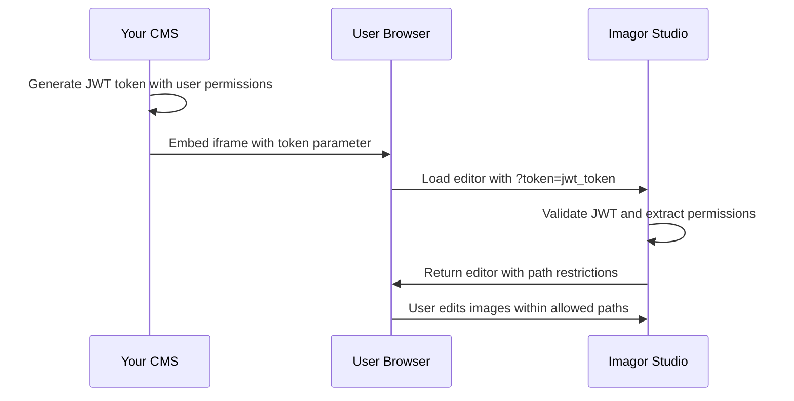

# Embedded Mode Integration

Imagor Studio's embedded mode allows you to seamlessly integrate the image editor into your existing CMS or web application. This guide covers everything you need to know to implement secure, path-restricted embedded integration.

## Overview

Embedded mode enables you to:

- **Embed the image editor** directly in your CMS interface
- **Restrict file access** to specific directories per user
- **Maintain security** through JWT-based authentication
- **Provide seamless UX** without redirecting users away from your application

## How It Works



### Key Components

1. **JWT Authentication**: Your CMS generates signed tokens containing user permissions
2. **Path Prefix Security**: Users can only access files within their designated directories
3. **Stateless Sessions**: No database storage required - all permissions encoded in JWT
4. **Embedded UI**: Editor adapts interface for embedded context

## Prerequisites

- Imagor Studio deployed with embedded mode enabled
- Shared JWT secret between your CMS and Imagor Studio
- HTTPS connection (required for secure iframe embedding)

## Environment Configuration

Enable embedded mode in your Imagor Studio deployment:

```bash
# Docker environment variables
EMBEDDED_MODE=true
JWT_SECRET=your-super-secret-jwt-key-here

# Or in configuration file
embedded_mode: true
jwt_secret: "your-super-secret-jwt-key-here"
```

:::warning Security Notice
Use a strong, randomly generated JWT secret and keep it secure. This secret is used to validate all embedded authentication tokens.
:::

## JWT Token Structure

Your CMS must generate JWT tokens with the following claims:

```javascript
{
  "user_id": "cms_user_123",           // Unique user identifier
  "role": "editor",                    // User role (editor, admin, etc.)
  "scopes": ["read", "edit"],          // Permissions array
  "path_prefix": "/user123/images/",   // Allowed directory path
  "is_embedded": true,                 // Embedded mode flag
  "exp": 1640995200,                   // Token expiration (Unix timestamp)
  "iat": 1640991600                    // Token issued at (Unix timestamp)
}
```

### Required Claims

| Claim     | Type   | Description                                                                  |
| --------- | ------ | ---------------------------------------------------------------------------- |
| `user_id` | string | Unique identifier for the user                                               |
| `role`    | string | User role (typically "editor" or "admin")                                    |
| `scopes`  | array  | Permissions: `["read"]`, `["read", "edit"]`, or `["read", "write", "admin"]` |
| `exp`     | number | Token expiration time (Unix timestamp)                                       |

### Optional Claims

| Claim         | Type    | Description                                           |
| ------------- | ------- | ----------------------------------------------------- |
| `path_prefix` | string  | Directory path restriction (e.g., "/user123/images/") |
| `is_embedded` | boolean | Set to `true` for embedded mode                       |
| `iat`         | number  | Token issued at time (Unix timestamp)                 |

## Creating JWT Tokens

### Node.js Example

```javascript
const jwt = require("jsonwebtoken");

function createEmbeddedToken(userId, pathPrefix) {
  const payload = {
    user_id: userId,
    role: "editor",
    scopes: ["read", "edit"],
    path_prefix: pathPrefix,
    is_embedded: true,
    exp: Math.floor(Date.now() / 1000) + 60 * 60, // 1 hour expiration
    iat: Math.floor(Date.now() / 1000),
  };

  return jwt.sign(payload, process.env.IMAGOR_STUDIO_JWT_SECRET);
}

// Usage
const token = createEmbeddedToken("user123", "/user123/images/");
```

### PHP Example

```php
<?php
require_once 'vendor/autoload.php';
use Firebase\JWT\JWT;
use Firebase\JWT\Key;

function createEmbeddedToken($userId, $pathPrefix) {
    $payload = [
        'user_id' => $userId,
        'role' => 'editor',
        'scopes' => ['read', 'edit'],
        'path_prefix' => $pathPrefix,
        'is_embedded' => true,
        'exp' => time() + (60 * 60), // 1 hour expiration
        'iat' => time()
    ];

    return JWT::encode($payload, $_ENV['IMAGOR_STUDIO_JWT_SECRET'], 'HS256');
}

// Usage
$token = createEmbeddedToken('user123', '/user123/images/');
?>
```

### Python Example

```python
import jwt
import time
import os

def create_embedded_token(user_id, path_prefix):
    payload = {
        'user_id': user_id,
        'role': 'editor',
        'scopes': ['read', 'edit'],
        'path_prefix': path_prefix,
        'is_embedded': True,
        'exp': int(time.time()) + (60 * 60),  # 1 hour expiration
        'iat': int(time.time())
    }

    return jwt.encode(payload, os.environ['IMAGOR_STUDIO_JWT_SECRET'], algorithm='HS256')

# Usage
token = create_embedded_token('user123', '/user123/images/')
```

## Frontend Integration

### Basic Iframe Embedding

```html
<!DOCTYPE html>
<html>
  <head>
    <title>CMS Image Editor</title>
    <style>
      .editor-container {
        width: 100%;
        height: 600px;
        border: 1px solid #ddd;
        border-radius: 8px;
        overflow: hidden;
      }

      .editor-iframe {
        width: 100%;
        height: 100%;
        border: none;
      }
    </style>
  </head>
  <body>
    <div class="editor-container">
      <iframe
        class="editor-iframe"
        src="https://your-imagor-studio.com/?token=YOUR_JWT_TOKEN_HERE&path=/user123/images/photo.jpg"
        allow="clipboard-write"
        sandbox="allow-scripts allow-same-origin allow-forms"
      >
      </iframe>
    </div>
  </body>
</html>
```

### Dynamic Token Generation

```javascript
// CMS JavaScript integration
class ImageEditorIntegration {
  constructor(studioUrl, jwtSecret) {
    this.studioUrl = studioUrl;
    this.jwtSecret = jwtSecret;
  }

  async openEditor(userId, imagePath) {
    // Generate token on your backend
    const response = await fetch("/api/generate-editor-token", {
      method: "POST",
      headers: { "Content-Type": "application/json" },
      body: JSON.stringify({
        userId: userId,
        imagePath: imagePath,
      }),
    });

    const { token } = await response.json();

    // Open editor with token
    const editorUrl = `${this.studioUrl}/?token=${token}&path=${encodeURIComponent(imagePath)}`;

    // Option 1: Open in iframe
    this.openInIframe(editorUrl);

    // Option 2: Open in modal
    this.openInModal(editorUrl);
  }

  openInIframe(url) {
    const iframe = document.createElement("iframe");
    iframe.src = url;
    iframe.style.width = "100%";
    iframe.style.height = "600px";
    iframe.style.border = "none";

    document.getElementById("editor-container").appendChild(iframe);
  }

  openInModal(url) {
    // Create modal with iframe
    const modal = document.createElement("div");
    modal.className = "editor-modal";
    modal.innerHTML = `
            <div class="modal-content">
                <button class="close-btn" onclick="this.closest('.editor-modal').remove()">×</button>
                <iframe src="${url}" style="width: 100%; height: 80vh; border: none;"></iframe>
            </div>
        `;

    document.body.appendChild(modal);
  }
}

// Usage
const editor = new ImageEditorIntegration(
  "https://your-imagor-studio.com",
  "your-jwt-secret",
);
editor.openEditor("user123", "/user123/images/photo.jpg");
```

## Path Prefix Security

Path prefixes provide directory-level access control, ensuring users can only access files within their designated folders.

### How Path Validation Works

1. **Token contains path prefix**: `/user123/images/`
2. **User requests file**: `/user123/images/photo.jpg` ✅ Allowed
3. **User requests outside path**: `/other-user/images/photo.jpg` ❌ Denied
4. **Path traversal attempt**: `/user123/images/../../../etc/passwd` ❌ Denied

### Path Prefix Examples

```javascript
// User-specific directory
{
  "path_prefix": "/user123/images/",
  // Allows: /user123/images/photo.jpg, /user123/images/subfolder/image.png
  // Denies: /user456/images/photo.jpg, /admin/config.json
}

// Department-specific directory
{
  "path_prefix": "/marketing/assets/",
  // Allows: /marketing/assets/banner.jpg, /marketing/assets/2024/campaign.png
  // Denies: /hr/documents/file.pdf, /finance/reports/data.xlsx
}

// Root access (admin users)
{
  "path_prefix": "/",
  // Allows: All paths
}

// No path prefix (backward compatibility)
{
  // No path_prefix field
  // Allows: All paths
}
```

### Security Features

- **Path normalization**: Prevents `../` traversal attacks
- **Strict validation**: Paths must start with the allowed prefix
- **Case-sensitive**: Path matching is case-sensitive
- **No wildcards**: Exact prefix matching only

## Complete Integration Example

Here's a complete example showing CMS integration with user management:

### Backend (Node.js/Express)

```javascript
const express = require("express");
const jwt = require("jsonwebtoken");
const app = express();

// User database (replace with your actual user system)
const users = {
  user123: {
    id: "user123",
    name: "John Doe",
    role: "editor",
    allowedPath: "/user123/images/",
  },
  admin456: {
    id: "admin456",
    name: "Admin User",
    role: "admin",
    allowedPath: "/",
  },
};

// Generate editor token endpoint
app.post("/api/generate-editor-token", (req, res) => {
  const { userId, imagePath } = req.body;
  const user = users[userId];

  if (!user) {
    return res.status(404).json({ error: "User not found" });
  }

  // Verify user can access the requested path
  if (!imagePath.startsWith(user.allowedPath)) {
    return res.status(403).json({ error: "Access denied to this path" });
  }

  const token = jwt.sign(
    {
      user_id: user.id,
      role: user.role,
      scopes:
        user.role === "admin" ? ["read", "write", "admin"] : ["read", "edit"],
      path_prefix: user.allowedPath,
      is_embedded: true,
      exp: Math.floor(Date.now() / 1000) + 60 * 60, // 1 hour
      iat: Math.floor(Date.now() / 1000),
    },
    process.env.IMAGOR_STUDIO_JWT_SECRET,
  );

  res.json({ token });
});

// Serve editor page
app.get("/editor/:userId", (req, res) => {
  const { userId } = req.params;
  const { path } = req.query;
  const user = users[userId];

  if (!user) {
    return res.status(404).send("User not found");
  }

  res.send(`
    <!DOCTYPE html>
    <html>
    <head>
        <title>Image Editor - ${user.name}</title>
        <style>
            body { margin: 0; font-family: Arial, sans-serif; }
            .header { background: #f5f5f5; padding: 1rem; border-bottom: 1px solid #ddd; }
            .editor-container { height: calc(100vh - 60px); }
            .editor-iframe { width: 100%; height: 100%; border: none; }
        </style>
    </head>
    <body>
        <div class="header">
            <h2>Editing: ${path || "Select an image"}</h2>
            <p>User: ${user.name} | Access: ${user.allowedPath}</p>
        </div>
        <div class="editor-container">
            <iframe id="editor" class="editor-iframe"></iframe>
        </div>
        
        <script>
            async function loadEditor() {
                const response = await fetch('/api/generate-editor-token', {
                    method: 'POST',
                    headers: { 'Content-Type': 'application/json' },
                    body: JSON.stringify({ 
                        userId: '${userId}',
                        imagePath: '${path || user.allowedPath}' 
                    })
                });
                
                const { token } = await response.json();
                const editorUrl = 'https://your-imagor-studio.com/?token=' + token + 
                                 '${path ? "&path=" + encodeURIComponent(path) : ""}';
                
                document.getElementById('editor').src = editorUrl;
            }
            
            loadEditor();
        </script>
    </body>
    </html>
  `);
});

app.listen(3000, () => {
  console.log("CMS server running on http://localhost:3000");
});
```

### Usage URLs

```bash
# Edit specific image for user123
http://localhost:3000/editor/user123?path=/user123/images/photo.jpg

# Browse user123's allowed directory
http://localhost:3000/editor/user123

# Admin user with full access
http://localhost:3000/editor/admin456
```

## API Reference

### Embedded Guest Login Endpoint

**POST** `/api/auth/embedded-guest`

Authenticates a user in embedded mode using a JWT token.

#### Request

```http
POST /api/auth/embedded-guest
Authorization: Bearer YOUR_JWT_TOKEN
Content-Type: application/json
```

#### Response

```json
{
  "token": "session_jwt_token_here",
  "expiresIn": 3600,
  "user": {
    "id": "embedded-guest-uuid",
    "displayName": "Embedded Guest",
    "username": "embedded-guest",
    "role": "guest"
  },
  "pathPrefix": "/user123/images/"
}
```

#### Error Responses

```json
// Invalid or expired token
{
  "error": {
    "code": "INVALID_TOKEN",
    "message": "Invalid or expired JWT token"
  }
}

// Embedded mode disabled
{
  "error": {
    "code": "PERMISSION_DENIED",
    "message": "Embedded mode is not enabled"
  }
}

// Path traversal attempt
{
  "error": {
    "code": "INVALID_INPUT",
    "message": "Invalid path prefix: path traversal not allowed"
  }
}
```

## Troubleshooting

### Common Issues

#### 1. "Embedded mode is not enabled"

**Solution**: Ensure `EMBEDDED_MODE=true` is set in your environment variables.

```bash
# Check your environment
echo $EMBEDDED_MODE

# Should output: true
```

#### 2. "Invalid or expired JWT token"

**Possible causes**:

- JWT secret mismatch between CMS and Imagor Studio
- Token expired (check `exp` claim)
- Malformed token structure

**Debug steps**:

```javascript
// Verify token structure
const jwt = require("jsonwebtoken");
try {
  const decoded = jwt.decode(token, { complete: true });
  console.log("Token header:", decoded.header);
  console.log("Token payload:", decoded.payload);
} catch (error) {
  console.error("Token decode error:", error);
}
```

#### 3. "Path access denied" errors

**Possible causes**:

- Requested path outside allowed prefix
- Case sensitivity mismatch
- Missing leading/trailing slashes

**Debug steps**:

```javascript
// Check path normalization
const requestedPath = "/user123/images/photo.jpg";
const allowedPrefix = "/user123/images/";

console.log("Requested:", requestedPath);
console.log("Allowed prefix:", allowedPrefix);
console.log("Starts with prefix:", requestedPath.startsWith(allowedPrefix));
```

#### 4. Iframe not loading

**Possible causes**:

- HTTPS required for secure iframe embedding
- Content Security Policy blocking iframe
- CORS issues

**Solutions**:

```html
<!-- Ensure proper iframe attributes -->
<iframe
  src="https://your-imagor-studio.com/?token=..."
  allow="clipboard-write"
  sandbox="allow-scripts allow-same-origin allow-forms"
>
</iframe>
```

### Debug Mode

Enable debug logging to troubleshoot issues:

```bash
# Environment variable
DEBUG=true

# Or in logs, look for:
# "Embedded guest login successful" - Authentication worked
# "Invalid path prefix" - Path validation failed
# "Token validation failed" - JWT issues
```

### Testing Your Integration

#### 1. Test Token Generation

```bash
# Use jwt.io to decode and verify your tokens
# Paste your token at https://jwt.io/

# Verify claims structure:
# - user_id: present and valid
# - scopes: contains required permissions
# - path_prefix: matches expected directory
# - exp: not expired
```

#### 2. Test Path Restrictions

```javascript
// Test different path scenarios
const testPaths = [
  "/user123/images/photo.jpg", // Should work
  "/user123/images/sub/image.png", // Should work
  "/other-user/images/photo.jpg", // Should fail
  "/user123/images/../config.json", // Should fail
];

testPaths.forEach((path) => {
  // Try accessing each path and verify expected behavior
});
```

#### 3. Test Token Expiration

```javascript
// Generate short-lived token for testing
const shortToken = jwt.sign(
  {
    user_id: "test",
    role: "editor",
    scopes: ["read", "edit"],
    exp: Math.floor(Date.now() / 1000) + 60, // 1 minute
  },
  secret,
);

// Test that access is denied after expiration
```

## Best Practices

### Security

1. **Use HTTPS**: Always serve over HTTPS in production
2. **Short token expiration**: Use 1-4 hour expiration times
3. **Strong JWT secret**: Use a cryptographically secure random key
4. **Validate paths**: Always validate requested paths against user permissions
5. **Audit logging**: Log all embedded authentication attempts

### Performance

1. **Token caching**: Cache valid tokens to reduce JWT generation overhead
2. **CDN integration**: Use CDN for static assets in embedded mode
3. **Lazy loading**: Load editor iframe only when needed

### User Experience

1. **Loading states**: Show loading indicators while editor initializes
2. **Error handling**: Provide clear error messages for failed authentication
3. **Responsive design**: Ensure editor works well in different iframe sizes
4. **Save notifications**: Notify users when images are saved successfully

## Next Steps

- [JWT Signing Examples](./jwt-signing.md) - More detailed token creation examples
- [API Reference](./api-reference.md) - Complete API documentation
- [Security Guide](../configuration/security.md) - Security best practices
- [Deployment Guide](../deployment/docker.md) - Production deployment

## Support

If you encounter issues with embedded mode integration:

1. Check the [troubleshooting section](#troubleshooting) above
2. Review server logs for authentication errors
3. Verify JWT token structure and claims
4. Test with a minimal integration example

For additional support, please refer to the project documentation or open an issue on GitHub.
