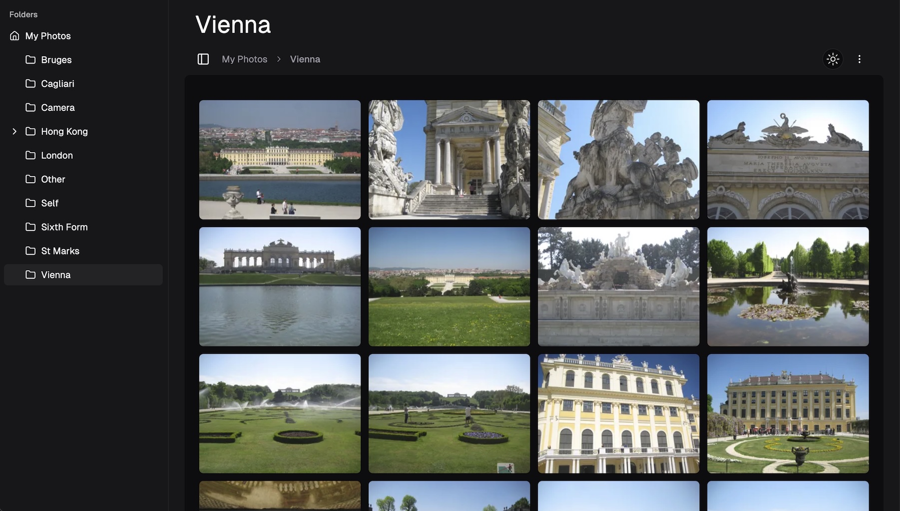
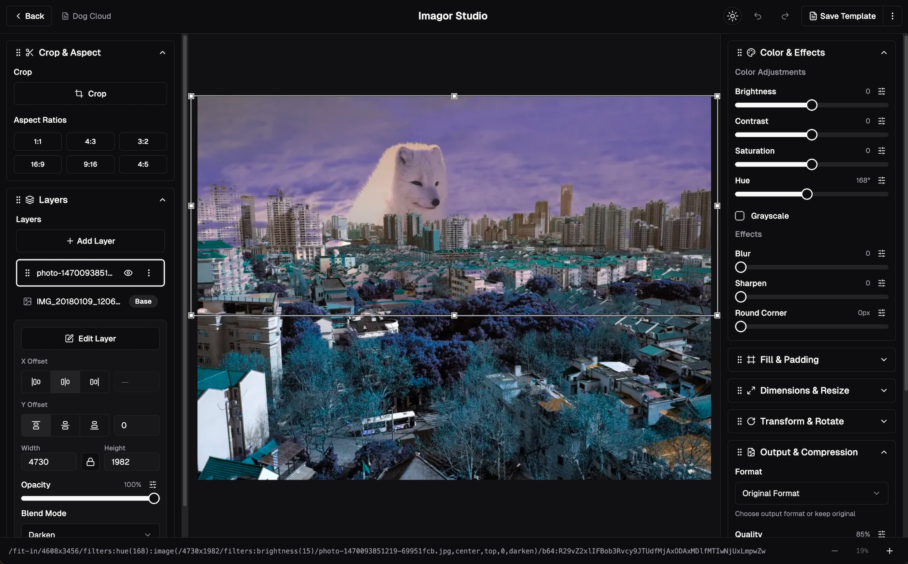
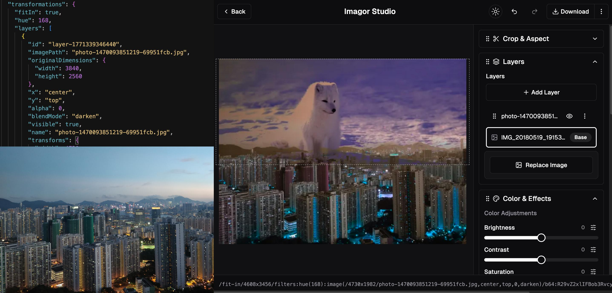

# Introduction

**Imagor Studio** is a self-hosted image gallery with built-in editing. Virtual scrolling, drag-and-drop management, multi-layer compositing, and template workflows.

### Gallery

Browse and organize your image files with virtual scrolling, drag-and-drop management, folder navigation, and multi-select for bulk operations.

### Image Editing

Image editing with real-time preview, multi-layer compositing, template workflows, color adjustments, effects, and cropping. All transformations are URL-based.

### Template Workflows

Save editing workflows as reusable templates. Stored as portable JSON files, apply the same edits across your entire image library.

## Key Features

- **Self-hosted image management** - Full control over your image library and data
- **Virtual scrolling gallery** - Efficient rendering for thousands of images
- **URL-based transformations** - Non-destructive image processing powered by [imagor](https://github.com/cshum/imagor) and libvips
- **Template-driven workflows** - Save and reuse editing workflows in open JSON format
- **Multi-layer compositing** - Stack and composite multiple images with independent transformations
- **Universal storage support** - Works with local filesystem, S3, MinIO, Cloudflare R2, and more

## What Makes Imagor Studio Special?

### Non-Destructive Workflow

All image transformations are URL-based, meaning your original images remain untouched. Generate transformed versions on-the-fly without modifying source files.

### Universal Storage Support

Works with local filesystems, S3-compatible storage, and more. Switch between storage backends without changing your workflow.

### Built on imagor

Imagor Studio is powered by [imagor](https://github.com/cshum/imagor), a fast and secure image processing server that provides URL-based image transformations. Imagor Studio extends imagor with a beautiful gallery interface and live editing capabilities, giving you the best of both worlds: imagor's powerful processing engine with an intuitive visual interface.

All image transformations benefit from imagor's high-performance architecture, comprehensive operation support, and proven reliability in production environments.

## Quick Links

- [Quick Start Guide](./getting-started/quick-start) - Get up and running in minutes
- [Configuration](./configuration/overview) - Customize Imagor Studio for your needs
- [Architecture](./architecture) - Understand how it works
- [GitHub Repository](https://github.com/cshum/imagor-studio) - Source code and issues

---

Ready to get started? Head over to the [Quick Start Guide](./getting-started/quick-start)!
