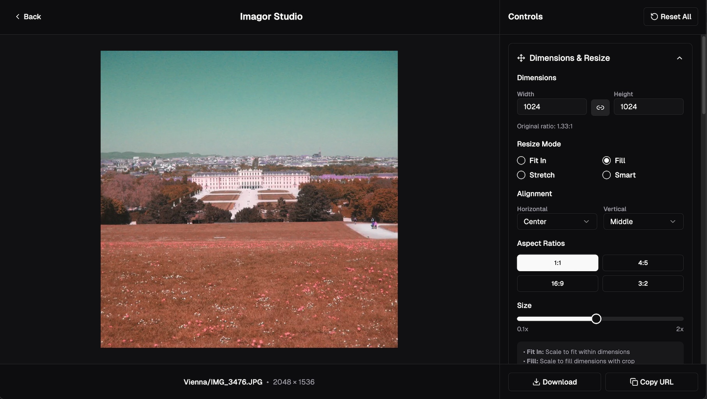

# Introduction

**Imagor Studio** is an open source, self-hosted image gallery with built-in editing. No cloud subscriptions, no vendor lock-in - just tools that work the way you need them to.

Browse thousands of images instantly with virtual scrolling. Edit with multi-layer compositing and template workflows. All transformations are URL-based and non-destructive.

### Gallery

Browse and organize your image files with virtual scrolling, drag-and-drop management, folder navigation, and multi-select for bulk operations.

### Image Editing

Image editing with real-time preview, multi-layer compositing, template workflows, color adjustments, effects, and cropping. All transformations are URL-based.

### Template Workflows

Save editing workflows as reusable templates. Stored as portable JSON files, apply the same edits across your entire image library.

## Key Features

- **Self-hosted image management** - Full control over your image library and data
- **No subscriptions or premium tiers** - Open source with optional one-time supporter license
- **Virtual scrolling gallery** - Browse thousands of images instantly with efficient rendering
- **URL-based transformations** - Non-destructive image processing powered by [imagor](https://github.com/cshum/imagor) and libvips
- **Template-driven workflows** - Save and reuse editing workflows in open JSON format
- **Multi-layer compositing** - Stack and composite multiple images with independent transformations
- **Universal storage support** - Works with local filesystem, S3, MinIO, Cloudflare R2, and more

## What Makes Imagor Studio Special?

We were serving millions of images but needed better tools for managing and editing them. When we looked at alternatives, they all wanted premium prices for basic features, or locked you into their cloud infrastructure.

So we built Imagor Studio - open source, self-hosted, and designed for people who want control over their images and workflows.

### Non-Destructive Workflow

All image transformations are URL-based, meaning your original images remain untouched. Generate transformed versions on-the-fly without modifying source files.

### Universal Storage Support

Works with local filesystems, S3-compatible storage, and more. Switch between storage backends without changing your workflow.

### Built on imagor

Imagor Studio is powered by [imagor](https://github.com/cshum/imagor), a fast and secure image processing server that provides URL-based image transformations. Imagor Studio extends imagor with a beautiful gallery interface and live editing capabilities, giving you the best of both worlds: imagor's powerful processing engine with an intuitive visual interface.

All image transformations benefit from imagor's high-performance architecture, comprehensive operation support, and proven reliability in production environments.

## Quick Links

- [Quick Start Guide](./getting-started/quick-start) - Get up and running in minutes
- [Configuration](./configuration/overview) - Customize Imagor Studio for your needs
- [Architecture](./architecture) - Understand how it works
- [GitHub Repository](https://github.com/cshum/imagor-studio) - Source code and issues

---

Ready to get started? Head over to the [Quick Start Guide](./getting-started/quick-start)!
